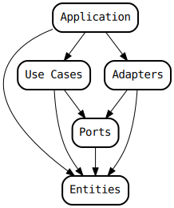

# Paper Tactics

## Architecture

The application has borrowed the concepts of a _port_ and an _adapter_ from the
[hexagonal architecture](<https://en.wikipedia.org/wiki/Hexagonal_architecture_(software)>)
and the concepts of a _use case_ and an _entity_ from the
[clean architecture](https://blog.cleancoder.com/uncle-bob/2012/08/13/the-clean-architecture.html). The dependency graph looks like this:

## Deployment

The production runs on AWS as a few lambdas,
a few DynamoDB tables and a WebSocket AWS API Gateway.
A CloudFormation template and the lambdas are within the `aws/` directory.
A lambda instantiates adapters, parses requests, and invokes a use case.

## Development

`app.py` is an application for local testing.
It requires `bidict`, `websockets` and `nest-asyncio` from PyPI.
The [frontend](https://www.paper-tactics.com) can connect to your locally run server
by selecting _Localhost_ from the server drop-down.

## Testing

Entity tests require `pytest` and `hypothesis`.
AWS adapter tests also require `docker`, `moto` and `boto3`.
Most of the tests check a lot of random inputs (property based, `hypothesis`),
so it's best to run them selectively.
