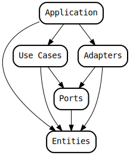

# Paper Tactics

## Architecture

The application has borrowed the concepts of a *port* and an *adapter* from the
[hexagonal architecture](https://en.wikipedia.org/wiki/Hexagonal_architecture_(software))
and the concepts of a *use case* and an *entity* from the
[clean architecture](https://blog.cleancoder.com/uncle-bob/2012/08/13/the-clean-architecture.html). The dependency graph looks like this:

## Test Coverage

